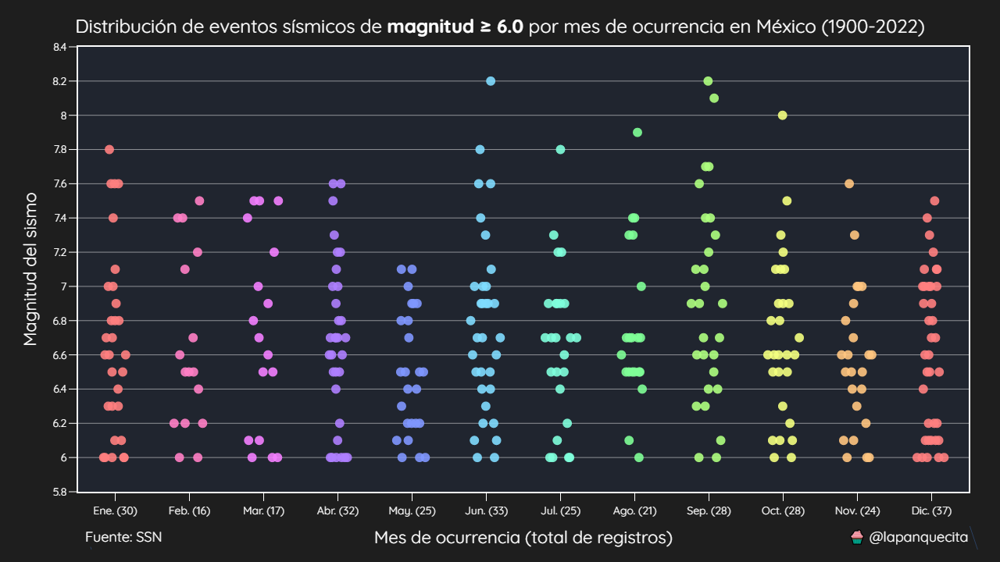
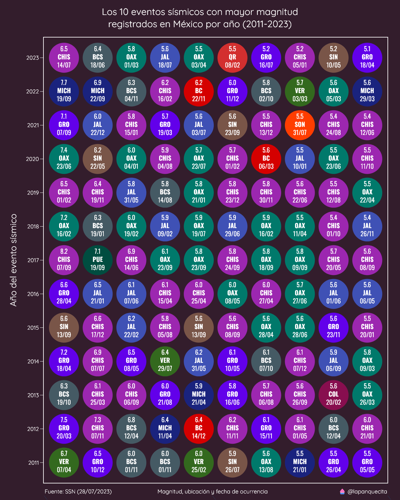

# Sismos en México

Este repositorio incluye un dataset con los eventos sísmicos registrados en México desde enero del 1900 hasta octubre del 2022.

También se incluyen algunos ejemplos de como crear gráficas con esta información.

## Distribución de sismos por mes de ocurrencia

## Los eventos sísmicos con mayor magnitud en México

En esta gráfica se muestran los eventos sísmicos con mayor magnitud en los últimos años. Para esto se utilizan varias series de scatter plots donde cada uno representa un año.

En cada círculo se muestra la magnitud, la entidad donde ocurrió el sismo, así como la fecha (día/mes).

