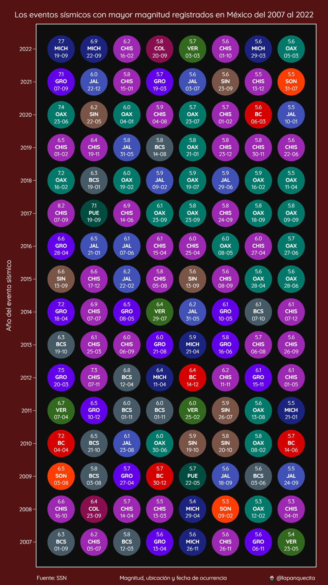

# Sismos en México

Este repositorio incluye un dataset con los eventos sísmicos registrados en México desde enero del 1900 hasta octubre del 2022.

También se incluyen algunos ejemplos de como crear gráficas con esta información.

## Distribución de sismos por mes de ocurrencia

## Los eventos sísmicos con mayor magnitud en México ocurrencia

