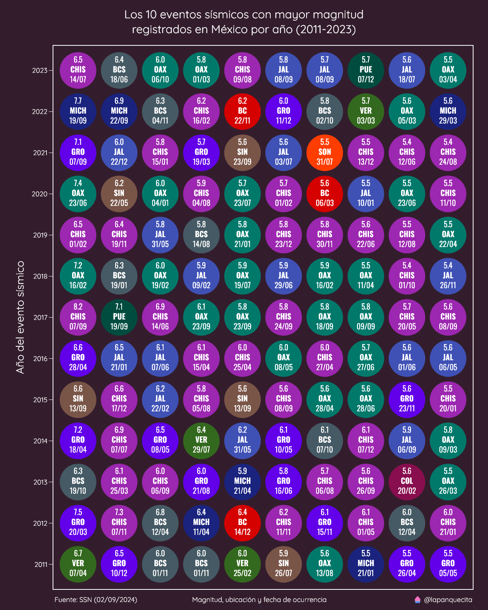
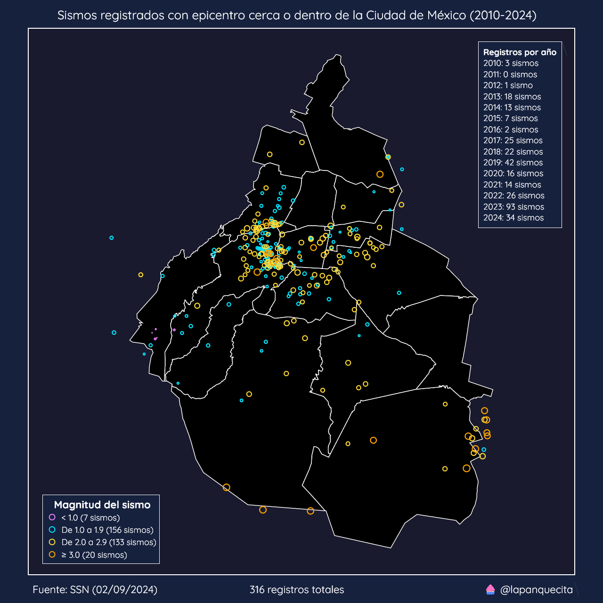

# Sismos en México

Este repositorio incluye un dataset con los eventos sísmicos registrados en México desde enero del 1900 hasta julio del 2023.

También se incluyen algunos ejemplos de como crear gráficas con esta información.

## Distribución de sismos por mes de ocurrencia

En México se cree que la mayoría de sismos fuertes ocurren en el mes de septiembre. Con esta gráfica se muestra el mes de ocurrencia así como la magnitud de cada sismo registrado desde 1990.

## Los eventos sísmicos con mayor magnitud en México

En esta gráfica se muestran los eventos sísmicos con mayor magnitud en los últimos años. Para esto se utilizan varias series de scatter plots donde cada uno representa un año.

En cada círculo se muestra la magnitud, la entidad donde ocurrió el sismo, así como la fecha (día/mes).

## Eventos sísmicos con epicentro cerca o dentro de la Ciudad de México

Durante el 2023 se han registrado el mayor número de eventos sísmicos dentro de la Ciudad de México. Con este mapa de dispersión se puede observar la ubicación de cada sismo, así como su magnitud y un desglose por año de registro.

